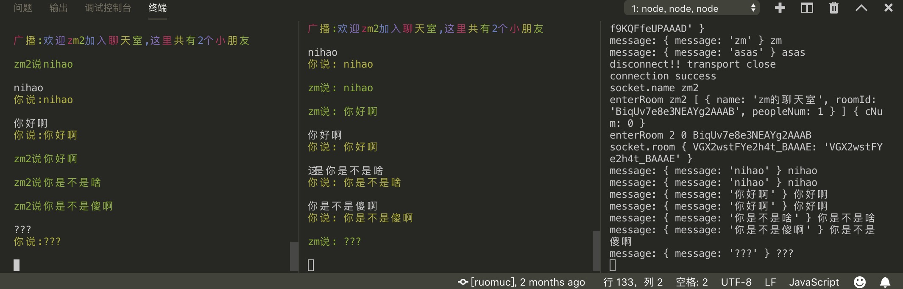

# command-chat
闲的无聊回头看了一下socket.io，然后无聊搞一个聊天室，然后一看，github上面大把开源聊天室。。。

emm....

那暂且作为一个后端，写一个命令行聊天室吧。。。

2019年3月23日20:28:36

使用方法就是：

- 前后端端口号对应，client.js的ip是服务器的ip，本地就localhost或者127.0.0.1
- 后端我部署在我的服务器上了，ip和端口都在client.js里面，如果什么都不该直接跑，就可以连到我的服务器那个后端哦。
- 控制台端虽然很黑科技，但是没有装node的小白用不了哦，有时间了搞个web端，因为不会画界面，所以你懂得。

2019年05月23日07:52:41

我自己的vps没续费了，使用自己配置一下ip和port。

2019年05月23日10:07:01

美化了一下客户端

演示图：

